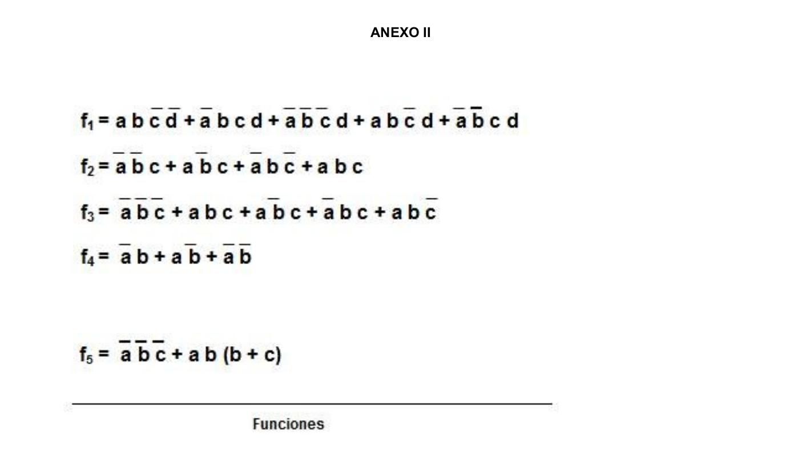

# TP2: Circuitos Combinatorios

---

## 1. _**Ejercicio:**_

### _Construya la tabla de verdad para las compuertas: AND, OR, NAND, NOR, XOR, NXOR, INVERSOR._

- ### Tabla de verdad de _**AND**_:

|  A  |  B  |  S  |
| :-: | :-: | :-: |
|  0  |  0  |  0  |
|  0  |  1  |  0  |
|  1  |  0  |  0  |
|  1  |  1  |  1  |

- ### Tabla de verdad de _**OR**_:

|  A  |  B  |  S  |
| :-: | :-: | :-: |
|  0  |  0  |  0  |
|  0  |  1  |  1  |
|  1  |  0  |  1  |
|  1  |  1  |  1  |

- ### Tabla de verdad de _**NAND**_:

|  A  |  B  |  S  |
| :-: | :-: | :-: |
|  0  |  0  |  1  |
|  0  |  1  |  1  |
|  1  |  0  |  1  |
|  1  |  1  |  0  |

- ### Tabla de verdad de _**NOR**_:

|  A  |  B  |  S  |
| :-: | :-: | :-: |
|  0  |  0  |  1  |
|  0  |  1  |  0  |
|  1  |  0  |  0  |
|  1  |  1  |  0  |

- ### Tabla de verdad de _**XOR**_:

|  A  |  B  |  S  |
| :-: | :-: | :-: |
|  0  |  0  |  0  |
|  0  |  1  |  1  |
|  1  |  0  |  1  |
|  1  |  1  |  0  |

- ### Tabla de verdad de _**NXOR**_:

|  A  |  B  |  S  |
| :-: | :-: | :-: |
|  0  |  0  |  1  |
|  0  |  1  |  0  |
|  1  |  0  |  0  |
|  1  |  1  |  1  |

- ### Tabla de verdad de _**INVERSOR**_:

|  A  |  F  |
| :-: | :-: |
|  1  |  0  |
|  0  |  1  |

---

## 2. _**Ejercicio:**_

### _Implemente las funciones lógicas NOT (una entrada), AND y OR (dos entradas), utilizando compuertas NOR_

- ### Función _**NOT**_:

- ### Función _**AND**_:

- ### Función _**OR**_:

---

## 3. _**Ejercicio:**_

- ### _Implemente la función lógica AND de cuatro entradas utilizando exclusivamente_:

1. _**Compuertas NOR de dos entradas**_
2. _**Compuertas NAND de dos entradas**_

- ### Función _**AND**_ con _**NOR**_:

- ### Función _**AND**_ con _**NAND**_:

---

## 5. _**Ejercicio:**_

### _Exprese la función de la tabla de verdad que se muestra en el Anexo I como suma de productos y como productos de suma. Simplifique por medio del álgebra de Boole_.

#### Suma de Productos:

## FALTA ESTE EJERCICIO (es muy largo)

#### Producto de Sumas:

---

## 6. _**Ejercicio:**_

### _Simplifique las funciones **f1** a **f4** del Anexo II, utilizando mapas de Karnaugh, álgebra de Boole y el método de Quine-McKluskey. Compare los resultados y elabore una conclusión_.

- ### F1:

- ### F2:

- ### F3:

- ### F4:

---

## 7. _**Ejercicio:**_

### _Dibuje el circuito lógico de las funciones simplificadas en el ejercicio anterior_.

- ### F1:

- ### F2:

- ### F3:

- ### F4:

---

## 8. _**Ejercicio:**_

### _Diseñe un circuito que acepte un carácter de 4 bits como entrada y genere una salida de 7 bits que corresponden al código de Hamming de paridad impar del carácter ingresado_.

- #### Había que hacerlo con las 16 posibilidades pero era muy largo asi que solo hice 2.

---

## 9. _**Ejercicio:**_

### _Resolver utilizando exclusivamente compuertas **NOR** la función **f5** del Anexo II_.

---

## 10. _**Ejercicio:**_

- ### _Diseñe los siguientes circuitos utilizando un multiplexor_.

1. _La función paridad de 5 (sale 1 si y sólo si hay un número par de unos en las entradas)_.
2. _La función Mayoría de 5 ( sale 1 si y sólo si hay más unos que ceros en las entradas)_.
3. _La función minoría de 5 (sale 1 si y sólo si hay más ceros que unos en las entradas)_.

---

## 11. _**Ejercicio:**_

### _Dos números de dos bits A=(a1,a0) y B=(b1,b0) deben compararse por medio de una función de 4 variables f(a0.a1.b0.b1). La función f debe tener el valor 1 si v(A) <= v(B), donde (x) = 2\*x1 + x0. Diseñe el circuito correspondiente para implementar la misma_.

---

## 12. _**Ejercicio:**_

### _Diseñe un circuito que acepte 4 bits en la entrada y que representen un dígito decimal en formato BCD y determine los valores de las siete salidas que corresponden a su representación en un display de siete segmentos. En el Anexo III, la figura 1 indica cómo se identifican cada uno de los siete segmentos en el display y la figura 2 muestra cómo debe construirse la tabla de verdad dando como ejemplo el resultado para los valores de entrada 0000 y 1001 respectivamente_.

---

## 13. _**Ejercicio:**_

### _Diseñe un circuito con cuatro entradas y tres salidas que funcione de acuerdo a la tabla 2 del Anexo I, la salida s3 indica que solo hay una entrada con valor 1 y s1 con s2 indican cual es la entrada que tiene dicho valor_.

---

## 14. _**Ejercicio:**_

### _Implemente un circuito con dos entradas y cuatro salidas, donde el valor presente en las entradas definirán qué salida estará en 1 (no debe haber mas de una salida con 1 simultáneamente)_.

---

## **Anexos**:

### _**Anexo 1**_:

### _**Anexo 2**_:

### _**Anexo 3**_:

